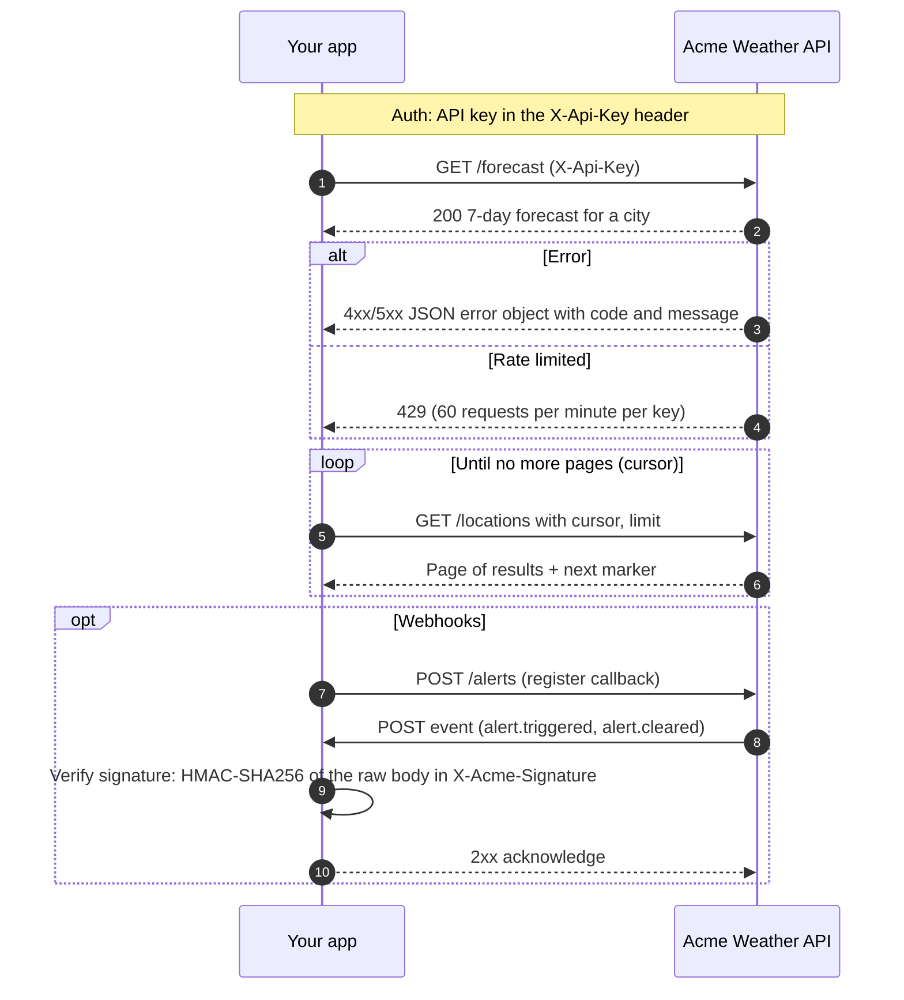

# API Integration Scout

**Live demo:** https://slavenasimeonova.github.io/api-integration-scout/ shows three saved runs (IPinfo, Notion, Postmark) replayed in the browser. Live runs are disabled there to control API costs. Clone the repo to run it locally. Hosting details: [docs/hosting.md](docs/hosting.md).

## Why I built this

I'm an integration architect with 7 years in enterprise telecom, and the slowest part of every integration is reading vendor docs and working out what's actually documented and what's assumed. This agent does that first pass, and it never presents a guess as fact.

## What it does

An AI agent that reads public API documentation and writes an **integration analysis**: base URL, authentication, main endpoints, pagination, rate limits, webhooks, error format, versioning, plus risks and open questions. It also generates a ready-to-import **Postman collection**.

It is built for APIs without an OpenAPI spec. Every finding is labelled:

| Label | Meaning |
| --- | --- |
| **Documented** | Stated in the docs. Comes with the source URL and a verbatim quote that the tool **checks automatically** against the fetched page. |
| **Inferred** | The agent's reasoning, with an explanation. Never presented as documented. |
| **Not found in docs** | The pages read don't cover it. The agent doesn't guess. |

If the agent marks something as documented but its quote can't be found on the cited page, the finding is downgraded to *Inferred* and listed as a risk.

## Real-world example: IPinfo

A real run against [IPinfo's developer docs](https://ipinfo.io/developers) (5-page limit, about 21 seconds, about $0.11). IPinfo accepts the same token three ways, and different client systems need different ones. The agent found all three, and each quote below was checked automatically against the page it came from:

| Auth method | Verified quote from the docs | In the Postman collection |
| --- | --- | --- |
| Bearer token (primary) | "A Bearer token in the Authorization header (Authorization: Bearer $TOKEN)" | Collection-level auth |
| Token in query | "A token query parameter (?token=$TOKEN)" | *Auth alternatives* → `?token={{apiKey}}` |
| HTTP Basic | "HTTP Basic Authentication (using the token as the username, e.g. curl -u $TOKEN:)" | *Auth alternatives* → Basic, `{{apiKey}}` as the username |

The same run marked pagination, webhooks and error format as **Not found in docs** rather than guessing. It also flagged risks a reviewer would raise, for example "Token in query string. The token is commonly shown as a query parameter, which can leak into logs; prefer the Bearer header server-side."

It also recorded that `GET /lookup/{ip}` needs a paid plan, with the quote "since /lookup is a paid-tier endpoint and will return an error on free tokens." The Postman request carries that note, and the Newman runner reports a 401/402/403 there as an **expected failure** instead of a plain FAIL.

**Tested end-to-end in Postman.** I imported the generated collection and environment, set my IPinfo token in `apiKey`, and `GET /lite/me` returned 200 with correct data. With Newman and a free (Lite) token, the `/lite` requests passed with all three auth methods, and `/lookup` returned 403, as the analysis predicted.

Full output, including the analysis, the Postman collection and the sequence diagram: [`examples/ipinfo/`](examples/ipinfo/).

## Setup (Windows, Command Prompt)

Requires **Node.js 22 or newer** (`node --version`).

```bat
cd C:\path\to\api-integration-scout
npm install
copy .env.example .env
notepad .env
```

Put your key in `.env` as `ANTHROPIC_API_KEY=...`. `.env` is git-ignored, and the key is never printed, logged or written to any output.

## Usage

```bat
npm run scout -- https://docs.example.com/api
```

| Option | Default | Description |
| --- | --- | --- |
| `--max-pages <n>` | 15 | Pages to fetch (same site only) |
| `--model <id>` | `claude-sonnet-5-5` | Claude model |
| `--out <dir>` | `outputs` | Output root folder |
| `--json` | off | Print progress events as JSON lines |

### Configuration (`.env`)

| Variable | Default | Effect |
| --- | --- | --- |
| `SCOUT_MODEL` | `claude-sonnet-5-5` | Model id |
| `SCOUT_MAX_PAGES` | `15` | Page limit per run |
| `SCOUT_MAX_TOKENS` | `150000` | Run stops when input + cache-write + output tokens exceed this |
| `SCOUT_MAX_BUDGET_USD` | `0.5` | Hard cost cap enforced by the Agent SDK |

Cache reads aren't counted against `SCOUT_MAX_TOKENS`. Every agent turn re-sends the conversation, and those re-reads are billed at a fraction of the input price. They are still reported, and the USD cap covers their cost.

### Outputs

Saved to `outputs/<api-name>/`:

| File | Contents |
| --- | --- |
| `analysis.json` | Full structured result (schema: `Analysis` in `src/core/schema.ts`) |
| `analysis.md` | Human-readable integration summary |
| `postman_collection.json` | Postman Collection v2.1 using `{{baseUrl}}` and `{{apiKey}}`. Validated against the official schema before saving. Path variables are prefilled only with values from the docs' own example URLs (e.g. `ip` = `8.8.8.8` from IPinfo's `curl` examples). A request body is set only when the docs show an example body, verified against the page; otherwise the request has no body and its description lists the documented body fields. When the docs state that an endpoint needs a plan or permission (verified quote), its request says so in the description and carries a `scoutRequires` variable for the Newman runner. Collection auth is the primary documented method; every other documented method (e.g. `?token={{apiKey}}`, HTTP Basic) gets a sample request in the **Auth alternatives** folder |
| `postman_environment.json` | Environment template: public `baseUrl` prefilled when known, `apiKey` empty |
| `sequence.mmd` | Mermaid sequence diagram of the main integration flow |

Every run, successful or failed, is appended to `outputs/runs.jsonl` with its tokens and cost.

To use the collection in Postman: *Import* both JSON files, select the environment, and paste your API key into `apiKey`.

**Tests in every request.** Each generated request carries a small Postman test script:

| Test | When |
| --- | --- |
| Status is 2xx | Always |
| Response time under `{{maxResponseMs}}` ms | Always (collection variable, default 5000) |
| Response is JSON (`Content-Type` contains `json` and the body parses) | Only with documented evidence: a verified quote of the endpoint mentions JSON, a documented finding says responses are JSON, or the path ends in `.json` or `/json`. Error-format quotes and URLs in quotes don't count. |

The tests never check response fields, so nothing the docs don't state is assumed. The scripts are fixed text: nothing from the docs or the model is inserted into them.

### Run the collection with Newman

`npm run postman:run` sends a generated collection with [Newman](https://github.com/postmanlabs/newman) and writes a report. It is safe by default:

- Only **GET** requests are sent. POST, PUT, PATCH and DELETE are skipped unless you pass `--allow-writes`.
- Also skipped, with the reason in the report: requests with an empty path variable or required query value, and requests flagged `[CHECK HOST]`.
- **Expected failures.** A 401, 402 or 403 counts as an *expected failure* when the analysis says the endpoint needs a plan or permission (a verified quote, e.g. IPinfo's `/lookup` on a free token), or when you name the request with `--expect-fail "GET /lookup/{ip}"` (repeatable). Expected failures are listed separately with the reason and don't fail the run. Any other status on such a request (404, 500, ...) is still a real failure.
- Requests go one at a time, 500 ms apart (`--delay`), with a 15-second timeout (`--timeout`).
- The target API's token comes from the `TARGET_API_TOKEN` environment variable (or `.env`). It is set as `{{apiKey}}` in memory only, never written to a file, and never printed.

PowerShell (npm is called as `npm.cmd`):

```powershell
$env:TARGET_API_TOKEN="your-ipinfo-token"
npm.cmd run postman:run -- examples\ipinfo\postman_collection.json --env examples\ipinfo\postman_environment.json
# also send POST/PUT/PATCH/DELETE:
npm.cmd run postman:run -- examples\ipinfo\postman_collection.json --env examples\ipinfo\postman_environment.json --allow-writes
# mark another request as expected to fail with your plan:
npm.cmd run postman:run -- examples\ipinfo\postman_collection.json --env examples\ipinfo\postman_environment.json --expect-fail "GET /lite/{ip}/{field}"
```

Command Prompt:

```bat
set TARGET_API_TOKEN=your-ipinfo-token
npm run postman:run -- examples\ipinfo\postman_collection.json --env examples\ipinfo\postman_environment.json
```

The report is saved as Markdown and JSON in `outputs/postman-runs/`. It covers each request (name, status, time, test results) and each skipped request with its reason. It records no headers, bodies, full URLs or credentials, and a run that would write the token into a report fails instead. The exit code is 1 if any request failed (expected failures don't count), so it also works in CI. A run sends real requests to the target API with your token and counts against that API's quota, but makes no Claude API calls.

## Web UI

A Next.js app in `web/` that wraps the same core. It has three parts:

- **Input:** paste a docs URL, or open one of three saved examples.
- **Live run:** a timeline of the agent's progress events, with page, token, time and cost meters.
- **Results:** Documented / Inferred / Not found badges with source quotes, the auth methods, endpoints, risks and open questions, the rendered sequence diagram, and download buttons.

| Part | What it does |
| --- | --- |
| `worker/` | Small `node:http` server around `runScout` (core unchanged). `POST /api/run` streams NDJSON: progress events, then the analysis and output files. `GET /api/limits` returns the runs left. |
| `worker/safe-fetch.ts` | SSRF-safe fetcher passed to `runScout`. Allows only http(s) on default ports. Resolves DNS first and blocks private, loopback, link-local and metadata addresses. Pins the connection to the checked address and re-checks every redirect. |
| `worker/limits.ts` | Live-run limits: 3 per visitor per day (by salted IP hash), 10 per day overall, $2 per day overall, 2 at a time. Each run reserves the per-run cap ($0.50) up front, then settles at its real cost. |
| `web/` | Next.js App Router. All pages are static; `/api/*` goes to the worker. |
| `examples/recordings/` | Three real runs (IPinfo, Notion, Postmark) with their progress events. `npm run build:examples` turns them into `web/public/examples/*.json`, so the examples replay instantly with no API call. The build re-applies the deterministic post-processing added since recording (auth rules, page numbering); the model's findings stay as recorded. |

Run it locally (two Command Prompt windows):

```bat
:: 1) the worker: real runs, uses ANTHROPIC_API_KEY from .env
npm run worker
:: ...or the offline fake worker (no key, no cost; paste https://docs.acmeweather.example/)
npm run worker:fake

:: 2) the web app on http://localhost:3000
cd web
npm install
npm run dev
```

Worker settings (environment variables): `PORT` (8787), `LIMIT_RUNS_PER_VISITOR` (3), `LIMIT_RUNS_PER_DAY` (10), `LIMIT_USD_PER_DAY` (2), `LIMIT_CONCURRENT_RUNS` (2), `WORKER_SECRET` (if set, every `/api` request needs it in `x-scout-secret`), `CLIENT_IP_HEADER` (the header carrying the client IP behind a trusted proxy) and `VISITOR_SALT`. The limit counters are in memory for now. A persistent store is chosen together with the hosting.

Static demo (examples only, no live runs, no API key): `npm run build:static` in `web/` exports the site to `web/out/`, and `npm run preview:static` serves it locally. GitHub Actions deploys it to GitHub Pages; see [docs/hosting.md](docs/hosting.md).

## Verification at work (offline fixture)

This excerpt comes from the offline test fixture: a small fake "Acme Weather API" docs site in `tests/fixtures/`. The scripted agent output deliberately includes a wrong endpoint quote and a made-up auth method, to show what verification does with them.

Progress in the CLI's format (illustrative: the events match the test run, the timings are made up):

```
17:20:01 >> Scouting https://docs.acmeweather.example/ with claude-sonnet-5-5
17:20:04 [page] Fetched Acme Weather API — Overview (1/15)
17:20:05 [auth_found] API key in X-Api-Key header
17:20:07 [page] Fetched Endpoints | Acme Weather API (2/15)
17:20:07 [page] Fetched Rate limits | Acme Weather API (3/15)
17:20:07 [page] Fetched Webhooks | Acme Weather API (4/15)
17:20:15 [check] endpoints[3] POST /alerts downgraded to inferred: quote not found on https://docs.acmeweather.example/endpoints
17:20:15 [done] Done: 9,000 tokens, $0.0321
```

`analysis.md` (excerpt):

```markdown
| Area | Finding | Status | Source |
| --- | --- | --- | --- |
| Base URL | https://api.acmeweather.example/v2 | Documented | [/](https://docs.acmeweather.example/) |
| Authentication | api_key: API key in the X-Api-Key header (+2 documented alternatives) | Documented | [/](https://docs.acmeweather.example/) |
| Pagination | cursor: Pass next_cursor as cursor | Documented | [/endpoints](https://docs.acmeweather.example/endpoints) |
| Rate limits | 60 requests per minute per key | Documented | [/rate-limits](https://docs.acmeweather.example/rate-limits) |
| Versioning | url_path (v2) | Inferred | [/](https://docs.acmeweather.example/) |
| Endpoints | 4 found | 3 documented, 1 inferred | — |

## Risks

- **HIGH**: Webhook signature verification required. Verify X-Acme-Signature before trusting payloads.
- **LOW**: Unverified claim: authAlternatives[2] bearer in header (Authorization). The agent marked this as documented, but quote not found on https://docs.acmeweather.example/. Treat it as inferred and confirm with the provider. _(verification check)_
- **LOW**: Unverified claim: endpoints[3] POST /alerts. The agent marked this as documented, but quote not found on https://docs.acmeweather.example/endpoints. Treat it as inferred and confirm with the provider. _(verification check)_
```

`sequence.mmd`:



The full rendered outputs are in `tests/__snapshots__/generators.test.ts.snap`.

## Architecture

```
src/
  core/            Agent core: no CLI or file-system code, reusable by the web app
    index.ts       Public API: runScout, ScoutError, loadConfig, types
    scout.ts       runScout(url, { config, onEvent, signal, fetcher, runner }) -> Analysis
    tools.ts       fetch_page and report_progress tools (DocsSession + in-process MCP server)
    html.ts        HTML -> text, link extraction, same-site rule, JS-rendering detection
    fetcher.ts     Fetcher interface + HTTP implementation
    verify.ts      Checks every "documented" quote against the fetched page text
    hosts.ts       Fixes or flags endpoint hosts using URLs in verified quotes
    budget.ts      Token budget tracking
    schema.ts      Zod schema for the agent's structured output + Analysis type
    events.ts      ProgressEvent union + emitter
    prompt.ts      System prompt (evidence rules)
    config.ts      Defaults and SCOUT_* env vars
  generators/      Deterministic code (no model calls): Analysis -> files in memory
    markdown.ts  postman.ts  postman-validate.ts  mermaid.ts  index.ts (buildOutputs)
  cli/index.ts     Argument parsing, progress printing, writing outputs/
schemas/           Official Postman Collection v2.1 JSON schema (draft-04), vendored
tests/             Vitest tests; fixtures/ holds saved HTML, so no network or API calls
```

**How a run works**

1. `runScout` starts the [Claude Agent SDK](https://code.claude.com/docs/en/agent-sdk/typescript) `query()` with **all built-in tools disabled** (`tools: []`). Only two in-process tools are allowed: `fetch_page` and `report_progress`. It also uses isolated settings (`settingSources: []`), no saved session, `maxTurns`, `maxBudgetUsd`, and a JSON Schema `outputFormat`.
2. `fetch_page` fetches pages itself rather than using the SDK's WebFetch, which returns a model-written summary. Fetching the raw page keeps the exact text, which is needed to verify quotes. It enforces the same-site rule and the page limit, and caps the text sent to the model at 12,000 characters per page. Page text is marked as untrusted content.
3. Pages with almost no text, or short pages that look client-rendered (a `<noscript>` notice or an empty `#root` / `#__next` mount), trigger a `low_text_warning`. They also produce the risk *"docs page may require JavaScript rendering; content may be incomplete"*.
4. The model's structured output is parsed with Zod. Then `verify.ts` checks each documented quote against the page it cites. Matching is normalized: case, whitespace, punctuation and Unicode spacing variants are ignored, but only whole words count.
5. Authentication: different client systems often need different auth methods, so every documented method is kept. `auth` holds the primary one and `authAlternatives` the rest, each with its own verified quote. Only documented methods go into the collection. An alternative that is inferred, or fails verification, is left out and listed in `warnings`. If the primary method is only inferred, the first documented alternative becomes the collection auth. Which documented method is primary is decided in code, not by the model: header methods (Bearer, custom header) first, then HTTP Basic, then a query parameter, because tokens in URLs leak into logs. A change is reported as an `auth_primary_changed` event and a warning. Endpoint params that carry the credential (e.g. `?token=`) are removed, since the auth method covers them.
6. Endpoint hosts are checked in code, not left to the prompt (`hosts.ts`). After verification, the full URLs in each endpoint's verified quotes are matched against its path template; for example, `/{ip}/json` matches `https://ipinfo.io/8.8.8.8/json`. If the docs show the endpoint only on another host, the endpoint is moved to that host. If they show it on several hosts, it gets a warning and a risk, and its Postman request is named `[CHECK HOST] ...` with the candidate hosts listed.
7. The generators turn the `Analysis` into the output files. The Postman collection is validated with Ajv against the official v2.1 schema and isn't saved if it fails.

**Progress events** (for the phase 2 web UI). Pass `onEvent` to `runScout`. Each event has `step`, `detail` and `at`:

| Step | When |
| --- | --- |
| `run_started` | Start of the run (url, model) |
| `page_fetched` / `page_skipped` | Each fetch (count, limit, skip reason) |
| `low_text_warning` | Page may need JavaScript rendering |
| `page_truncated` | Page text exceeded 12,000 characters; also noted in `warnings` and `analysis.md` |
| `base_url_found`, `auth_found`, `endpoint_found`, `pagination_found`, `rate_limit_found`, `webhooks_found`, `error_format_found`, `versioning_found`, `not_found`, `risk_found`, `note` | Reported live by the agent |
| `usage_update` / `budget_exceeded` | Token tally after each model response |
| `verification_downgrade` | A documented claim failed quote verification |
| `auth_primary_changed` | The primary auth method was replaced by a better-ranked documented one |
| `endpoint_host_corrected` / `endpoint_host_ambiguous` | An endpoint's host was taken from a verified example URL, or the docs show it on several hosts |
| `run_completed` / `run_failed` | End of the run |

A Next.js route can call `runScout(url, { onEvent: e => stream.write(e), signal: request.signal })` and then `buildOutputs(analysis)` to get the files as strings.

## Tests

```bat
npm test
npm run typecheck
```

The tests use saved HTML fixtures and a scripted stand-in for the Agent SDK (`tests/helpers/fake-runner.ts`), so they don't touch the network or the API. They cover:

- HTML extraction and the same-site rule
- Page limits
- JS-rendering detection
- Normalized quote verification
- The token budget
- Typed failures
- Postman schema validation and a no-secrets check
- Snapshots of the Markdown and Mermaid output

## Limitations

- Docs that render only with JavaScript can't be read. They are flagged, not executed.
- Only up to `SCOUT_MAX_PAGES` pages are read, and page text sent to the model is capped at 12,000 characters. Large references may be only partly covered. Both cases are reported: each truncated page gets a `page_truncated` event and a warning ("findings from this page may be incomplete"), and hitting the page limit adds a warning.
- The same-site rule allows the starting host and its parent/child subdomains (`docs.stripe.com` and `stripe.com`). Docs hosted on a different domain aren't followed.
- Costs are the SDK's estimates, not a billing statement.

## Author

Slavena Simeonova · [linkedin.com/in/slavenasimeonova](https://www.linkedin.com/in/slavenasimeonova)
