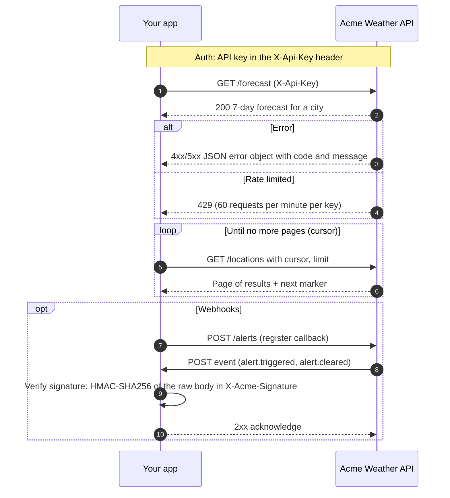

# API Integration Scout

An AI agent that reads public API documentation and writes an **integration analysis**: base URL, authentication, main endpoints, pagination, rate limits, webhooks, error format, versioning, plus risks and open questions. It also generates a ready-to-import **Postman collection**.

It is built for APIs without an OpenAPI spec. Every finding is labelled:

| Label | Meaning |
| --- | --- |
| **Documented** | Stated in the docs. Comes with the source URL and a verbatim quote that the tool **checks automatically** against the fetched page. |
| **Inferred** | The agent's reasoning, with an explanation. Never presented as documented. |
| **Not found in docs** | The pages read don't cover it. The agent doesn't guess. |

If the agent marks something as documented but its quote can't be found on the cited page, the finding is downgraded to *Inferred* and listed as a risk.

## Setup (Windows, Command Prompt)

Requires **Node.js 22 or newer** (`node --version`).

```bat
cd C:\path\to\api-integration-scout
npm install
copy .env.example .env
notepad .env
```

Put your key in `.env` as `ANTHROPIC_API_KEY=...`. `.env` is git-ignored, and the key is never printed, logged or written to any output.

## Usage

```bat
npm run scout -- https://docs.example.com/api
```

| Option | Default | Description |
| --- | --- | --- |
| `--max-pages <n>` | 15 | Pages to fetch (same site only) |
| `--model <id>` | `claude-sonnet-5-5` | Claude model |
| `--out <dir>` | `outputs` | Output root folder |
| `--json` | off | Print progress events as JSON lines |

### Configuration (`.env`)

| Variable | Default | Effect |
| --- | --- | --- |
| `SCOUT_MODEL` | `claude-sonnet-5-5` | Model id |
| `SCOUT_MAX_PAGES` | `15` | Page limit per run |
| `SCOUT_MAX_TOKENS` | `150000` | Run stops when input + cache-write + output tokens exceed this |
| `SCOUT_MAX_BUDGET_USD` | `0.5` | Hard cost cap enforced by the Agent SDK |

Cache reads aren't counted against `SCOUT_MAX_TOKENS`. Every agent turn re-sends the conversation, and those re-reads are billed at a fraction of the input price. They are still reported, and the USD cap covers their cost.

### Outputs

Saved to `outputs/<api-name>/`:

| File | Contents |
| --- | --- |
| `analysis.json` | Full structured result (schema: `Analysis` in `src/core/schema.ts`) |
| `analysis.md` | Human-readable integration summary |
| `postman_collection.json` | Postman Collection v2.1 using `{{baseUrl}}` and `{{apiKey}}`. Validated against the official schema before saving. Collection auth is the primary documented method; every other documented method (e.g. `?token={{apiKey}}`, HTTP Basic) gets a sample request in the **Auth alternatives** folder |
| `postman_environment.json` | Environment template: public `baseUrl` prefilled when known, `apiKey` empty |
| `sequence.mmd` | Mermaid sequence diagram of the main integration flow |

Every run, successful or failed, is appended to `outputs/runs.jsonl` with its tokens and cost.

To use the collection in Postman: *Import* both JSON files, select the environment, and paste your API key into `apiKey`.

## Example output

This excerpt was generated from the offline test fixture: a small fake "Acme Weather API" docs site in `tests/fixtures/`. One endpoint quote in the fixture is deliberately wrong, to show verification at work.

Progress in the CLI's format (illustrative: the events match the test run, the timings are made up):

```
17:20:01 >> Scouting https://docs.acmeweather.example/ with claude-sonnet-5-5
17:20:04 [page] Fetched Acme Weather API — Overview (1/15)
17:20:05 [auth_found] API key in X-Api-Key header
17:20:07 [page] Fetched Endpoints | Acme Weather API (2/15)
17:20:07 [page] Fetched Rate limits | Acme Weather API (3/15)
17:20:07 [page] Fetched Webhooks | Acme Weather API (4/15)
17:20:15 [check] endpoints[3] POST /alerts downgraded to inferred: quote not found on https://docs.acmeweather.example/endpoints
17:20:15 [done] Done: 9,000 tokens, $0.0321
```

`analysis.md` (excerpt):

```markdown
| Area | Finding | Status | Source |
| --- | --- | --- | --- |
| Base URL | https://api.acmeweather.example/v2 | Documented | [/](https://docs.acmeweather.example/) |
| Authentication | api_key: API key in the X-Api-Key header | Documented | [/](https://docs.acmeweather.example/) |
| Pagination | cursor: Pass next_cursor as cursor | Documented | [/endpoints](https://docs.acmeweather.example/endpoints) |
| Rate limits | 60 requests per minute per key | Documented | [/rate-limits](https://docs.acmeweather.example/rate-limits) |
| Versioning | url_path (v2) | Inferred | [/](https://docs.acmeweather.example/) |
| Endpoints | 4 found | 3 documented, 1 inferred | — |

## Risks

- **HIGH**: Webhook signature verification required. Verify X-Acme-Signature before trusting payloads.
- **LOW**: Unverified claim: endpoints[3] POST /alerts. The agent marked this as documented, but quote not found on https://docs.acmeweather.example/endpoints. Treat it as inferred and confirm with the provider. _(verification check)_
```

`sequence.mmd`:



The full rendered outputs are in `tests/__snapshots__/generators.test.ts.snap`.

## Architecture

```
src/
  core/            Agent core: no CLI or file-system code, reusable by the web app
    index.ts       Public API: runScout, ScoutError, loadConfig, types
    scout.ts       runScout(url, { config, onEvent, signal, fetcher, runner }) -> Analysis
    tools.ts       fetch_page and report_progress tools (DocsSession + in-process MCP server)
    html.ts        HTML -> text, link extraction, same-site rule, JS-rendering detection
    fetcher.ts     Fetcher interface + HTTP implementation
    verify.ts      Checks every "documented" quote against the fetched page text
    budget.ts      Token budget tracking
    schema.ts      Zod schema for the agent's structured output + Analysis type
    events.ts      ProgressEvent union + emitter
    prompt.ts      System prompt (evidence rules)
    config.ts      Defaults and SCOUT_* env vars
  generators/      Deterministic code (no model calls): Analysis -> files in memory
    markdown.ts  postman.ts  postman-validate.ts  mermaid.ts  index.ts (buildOutputs)
  cli/index.ts     Argument parsing, progress printing, writing outputs/
schemas/           Official Postman Collection v2.1 JSON schema (draft-04), vendored
tests/             Vitest tests; fixtures/ holds saved HTML, so no network or API calls
```

**How a run works**

1. `runScout` starts the [Claude Agent SDK](https://code.claude.com/docs/en/agent-sdk/typescript) `query()` with **all built-in tools disabled** (`tools: []`). Only two in-process tools are allowed: `fetch_page` and `report_progress`. It also uses isolated settings (`settingSources: []`), no saved session, `maxTurns`, `maxBudgetUsd`, and a JSON Schema `outputFormat`.
2. `fetch_page` fetches pages itself rather than using the SDK's WebFetch, which returns a model-written summary. Fetching the raw page keeps the exact text, which is needed to verify quotes. It enforces the same-site rule and the page limit, and caps the text sent to the model at 12,000 characters per page. Page text is marked as untrusted content.
3. Pages with almost no text, or short pages that look client-rendered (a `<noscript>` notice or an empty `#root` / `#__next` mount), trigger a `low_text_warning`. They also produce the risk *"docs page may require JavaScript rendering; content may be incomplete"*.
4. The model's structured output is parsed with Zod. Then `verify.ts` checks each documented quote against the page it cites. Matching is normalized: case, whitespace, punctuation and Unicode spacing variants are ignored, but only whole words count.
5. Authentication: different client systems often need different auth methods, so every documented method is kept. `auth` holds the primary one and `authAlternatives` the rest, each with its own verified quote. Only documented methods go into the collection. An alternative that is inferred, or fails verification, is left out and listed in `warnings`. If the primary method is only inferred, the first documented alternative becomes the collection auth.
6. The generators turn the `Analysis` into the output files. The Postman collection is validated with Ajv against the official v2.1 schema and isn't saved if it fails.

**Progress events** (for the phase 2 web UI). Pass `onEvent` to `runScout`. Each event has `step`, `detail` and `at`:

| Step | When |
| --- | --- |
| `run_started` | Start of the run (url, model) |
| `page_fetched` / `page_skipped` | Each fetch (count, limit, skip reason) |
| `low_text_warning` | Page may need JavaScript rendering |
| `page_truncated` | Page text exceeded 12,000 characters; also noted in `warnings` and `analysis.md` |
| `base_url_found`, `auth_found`, `endpoint_found`, `pagination_found`, `rate_limit_found`, `webhooks_found`, `error_format_found`, `versioning_found`, `not_found`, `risk_found`, `note` | Reported live by the agent |
| `usage_update` / `budget_exceeded` | Token tally after each model response |
| `verification_downgrade` | A documented claim failed quote verification |
| `run_completed` / `run_failed` | End of the run |

A Next.js route can call `runScout(url, { onEvent: e => stream.write(e), signal: request.signal })` and then `buildOutputs(analysis)` to get the files as strings.

## Tests

```bat
npm test
npm run typecheck
```

The tests use saved HTML fixtures and a scripted stand-in for the Agent SDK (`tests/helpers/fake-runner.ts`), so they don't touch the network or the API. They cover:

- HTML extraction and the same-site rule
- Page limits
- JS-rendering detection
- Normalized quote verification
- The token budget
- Typed failures
- Postman schema validation and a no-secrets check
- Snapshots of the Markdown and Mermaid output

## Limitations

- Docs that render only with JavaScript can't be read. They are flagged, not executed.
- Only up to `SCOUT_MAX_PAGES` pages are read, and page text sent to the model is capped at 12,000 characters. Large references may be only partly covered. Both cases are reported: each truncated page gets a `page_truncated` event and a warning ("findings from this page may be incomplete"), and hitting the page limit adds a warning.
- The same-site rule allows the starting host and its parent/child subdomains (`docs.stripe.com` and `stripe.com`). Docs hosted on a different domain aren't followed.
- Costs are the SDK's estimates, not a billing statement.
